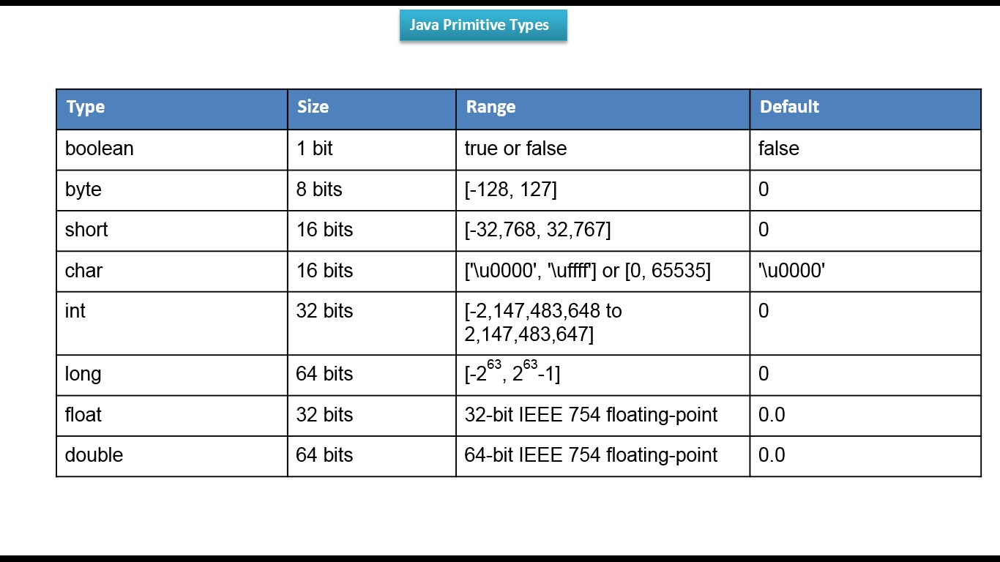

# Studies about java

## Expected case in java

### Packages and classes

Always using Upper in the start of each word

#### Example Packages and classes

MyFirstClass
ProjectSchool

### Variables

Lower Case first word and after upper the start of each word

#### Example Variables

myFirstClass
projectSchool
myName

## Basic

### Hello World

```java
public static void main(String[] args){
    System.out.println("Hello World");

}
```

### JavaDoc

```java
/**
 * Java doc comment
*/
public static void main(String[] args){
    System.out.println("Hello World");

}
```

### Syntax

#### Create main(runable) class

```java
public static void main(String[] args){
  System.out.println("Hello World");

}
```

#### Primitive types



#### Non Primitive Types

String
List
Date

#### Defining Variables

```java
primitive_type variable_name value;

int age 10;
boolean compare true;
```

#### Specify tipe value

insert the letter that corresponde to the wanting type, example: f or F = Float, d or D = Double.

```java

float salary = 2500.8f

```

#### Casting

Forcing variable to receive a value, even if the value is higher than max, this result in some weird results.

```java
int age = (int) 10000000000l;

```

#### operators

##### Arithmetic

    + - * /

##### OBS

In java divison between 2 int numbers will result print

##### Others

% - result of division
** - power

#### Logic

&& - and
// - or
! - not

#### Assignment

variable += number
variable -= number
variable *= number
variable /= number

variable++ - run first then sum one
variable-- - run first then reduce one
++variable - sum one first then run
--variable - reduce one first then run

#### Ternary

condition ? if true : if false

### Conditional structure

#### If, else, else if

Verify a condition, if true run the code block, if not pass

##### Example If

```java

int idade = 65;
boolean isAdulto = idade >= 18;
if(isAdulto){
   System.out.println("Authorizado");
}else if(idade >= 60) {
   System.out.println("Terceira idade");
}else {
   System.out.println("Não Authorizado");
}

```

#### Switch

Verify if a varible match one of the mapped cases

#### Example Switch

```java

char sexo = 'F';
switch (sexo){
  case 'M':
      System.out.println("Homem");
      break;
  case 'F':{
      System.out.println("Mulher");
      break;
  }
  default: {
      System.out.println("Opção invalida");
      break;
  }
}

```

### Userfull hotkeys in intelij

+ `psvm` - create main class
+ `sout` - generate:  `System.out.println()`

## Free Courses

### EN-US

+ [Quick introduction java](https://www.youtube.com/watch?v=RRubcjpTkks)
+ [Full basic course 2.5 h](https://www.youtube.com/watch?v=eIrMbAQSU34)
+ [Full course 12 h](https://www.youtube.com/watch?v=xk4_1vDrzzo)

### PT-BR

+ [Maratona Java](https://www.youtube.com/playlist?list=PL62G310vn6nFIsOCC0H-C2infYgwm8SWW)
